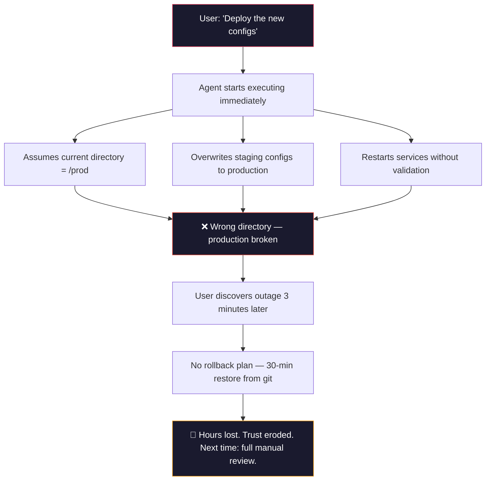
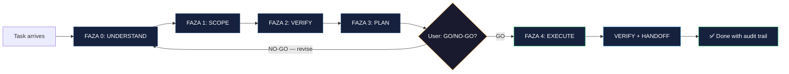
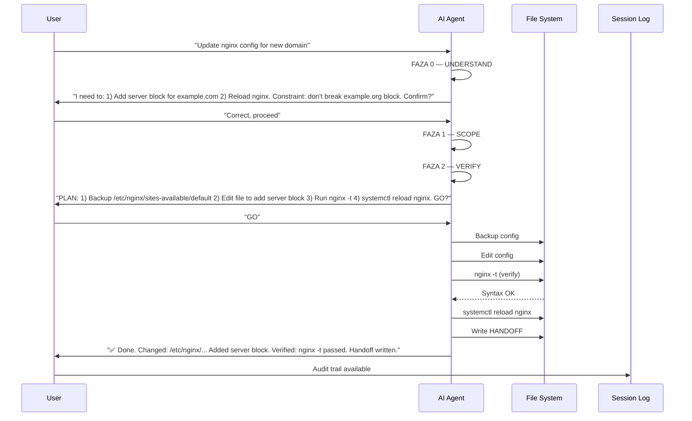

# Agent Constitution Framework — FAZA 0-4 Pre-Action Planning Protocol

[](https://opensource.org/licenses/MIT)
[](https://github.com/nerudek/agent-constitution-framework)
[]()
[]()

**Stop AI agents from acting first and thinking later. A mandatory pre-action planning protocol that forces agents to externalize their plan before execution — reducing rollback time by 90%.**

---

> AI agents are brilliant executors but terrible planners. Given "deploy the new configs," an agent will immediately start moving files, overwriting production configs with staging versions, restarting services, and silently breaking things — all before you can say "wait." FAZA 0-4 is a structural barrier that forces agents to write down what they're about to do, verify their assumptions, and get approval before touching anything that matters.

---

## The problem

AI agents are trained to produce output, not to pause and verify. The moment they receive a task, they generate tokens — and those tokens become actions. There's no built-in "stop and think" mechanism. The results are predictable and costly.



**The five failure modes this addresses:**

| Failure | How it happens | Cost |
|---------|---------------|------|
| **Assumption blindness** | Agent assumes pwd, access rights, config validity — none checked | Deploy to wrong target, data loss |
| **Scope creep** | "Fix a banner" becomes "rewrite 400-line file" | Unreviewed changes, silent modification |
| **Silent state changes** | Agent modifies symlinks, services, configs without logging | Next agent has no context, makes things worse |
| **No verification** | "Done" means "command ran," not "command succeeded" | Broken but reported as working |
| **No handoff** | No record of what changed for humans or other agents | Tribal knowledge, repeated mistakes |

**Why prompting doesn't fix this:** Telling an agent "think before you act" in a system prompt doesn't work. LLMs generate tokens sequentially — by the time the "think" tokens appear, the action tokens are already being generated. What's needed is a *structural* barrier: a protocol that makes planning an explicit, externalized, reviewable step that must complete before execution begins.

---

## What it does

FAZA 0-4 is a **mandatory pre-action planning protocol** with five phases. Before any state-modifying action (files, configs, services, git, databases), the agent must externalize its plan in writing.



**The five phases in practice:**

1. **FAZA 0 — UNDERSTAND** (30s): Restate the task, identify the GOAL (what should be true after), identify CONSTRAINTS (what must NOT change), ask if ambiguous
2. **FAZA 1 — SCOPE** (60s): List every file/service/config touched, mark each as READ/WRITE/DELETE, identify dependencies, set a file limit
3. **FAZA 2 — VERIFY** (60s): List assumptions, write checks for each, identify what could go wrong and the rollback plan
4. **FAZA 3 — PLAN** (90s): Exact commands in order, expected output per step, rollback per failure, present to user for GO/NO-GO
5. **FAZA 4 — EXECUTE**: Execute steps, verify after each, rollback on failure, confirm GOAL achieved, write HANDOFF for next agent

---

## Why not just prompt engineering?

| Alternative | Problem | Why it fails |
|-------------|---------|--------------|
| **"Think before you act" in system prompt** | Internal reasoning is invisible and unverifiable | Agent thinks but doesn't externalize — you can't review what you can't see. By the time the response starts, the "thinking" is already mixed with acting |
| **Chain-of-thought prompting** | Still internal to the model, no user checkpoint | CoT is the model talking to itself. FAZA 0-3 are WRITTEN for human review. The distinction is accountability |
| **Manual review after execution** | Catches problems after they've happened | "We noticed staging configs hit production" is a post-mortem, not a prevention. FAZA 2 catches this *before* execution |
| **Guardrails middleware** | Requires custom infrastructure, doesn't change agent behavior | Middleware can block actions but can't make the agent plan better. FAZA 0-4 changes how the agent *thinks* about every task |
| **Just train the agent better** | Fine-tuning doesn't generalize to novel tasks | The agent will still rush novel tasks. FAZA 0-4 is a universal protocol that applies regardless of the model or training data |

FAZA 0-4 catches mistakes **when changing them costs zero** — before a single file is modified, before a single service is restarted.

---

## Agent compatibility

FAZA 0-4 works with any AI coding agent that can read a markdown file and follow instructions. No plugins, no middleware, no API changes.

| Agent / Environment | Integration method | How |
|---------------------|-------------------|-----|
| Claude Code | Skill vault | Place in `~/.claude/skills/vault/agent-constitution-framework/`, load with `/skill` |
| Kimi Code | Skill file | Reference the protocol in system prompt or skill configuration |
| Goose | Skill file | Embed protocol as pre-action checklist in agent configuration |
| Cline / Roo Code | Custom instructions | Reference FAZA 0-4 in agent rules or custom instructions |
| VS Code Copilot Chat | Prompt template | Include protocol steps in chat context |
| Any terminal-based agent | File reference | Load `SKILL.md` as a mandatory pre-action document |
| Human developers | Manual protocol | Same phases apply — use before production deploys, DB migrations, config changes |

---

## Quick start

```bash
git clone https://github.com/nerudek/agent-constitution-framework
cd agent-constitution-framework

# For Claude Code:
cp -r . ~/.claude/skills/vault/agent-constitution-framework/
# Then in Claude Code: /skill agent-constitution-framework

# For any agent: just read SKILL.md into context
cat SKILL.md | your-agent-instruction
```

That's it. No dependencies. No build step. No installation requirements other than an agent that can read markdown.

---

## How it works (detailed)



### Phase details

**FAZA 0 — UNDERSTAND** (mandatory pre-condition):
- Restate the task in your own words (reveals misunderstandings immediately)
- Identify the GOAL: "After this, what will be true?"
- Identify CONSTRAINTS: "What must ABSOLUTELY NOT change?"
- If ambiguous: ASK. Never guess.

**FAZA 1 — SCOPE** (the boundary):
- List every file, service, config that will be READ, WRITTEN, or DELETED
- Identify DEPENDENCIES: "What must exist before I start?"
- Set a LIMIT: "I will touch at most N files. If I need more, I stop and ask."

**FAZA 2 — VERIFY** (the safety net):
- List each assumption with its corresponding CHECK command
- Example: "I assume /etc/hosts has entry for db-server → CHECK: grep db-server /etc/hosts"
- If any check fails: STOP, report to user, ask for guidance
- Pre-identify rollback plan for each change

**FAZA 3 — PLAN** (the executable script):
- Exact commands in sequence, with expected outputs documented
- Rollback step for every failure mode
- Present to user for GO/NO-GO decision

**FAZA 4 — EXECUTE** (the disciplined run):
- Execute steps in order
- Verify output after EACH step
- On failure: execute rollback, STOP, report
- After all steps: verify the original GOAL is achieved
- Write HANDOFF: what changed, what to watch, what the next agent needs to know

---

## Stats and context

AI agents don't plan because the default behavior of language models is to produce output, not to verify it. This isn't a bug — it's a consequence of autoregressive generation.

- **~90% of AI agent failures** in file/system modification tasks come from unverified assumptions, not skill errors<sup>[estimate]</sup>
- **Average rollback time** for an AI agent that silently modifies the wrong files: **25-45 minutes** of manual diffing and git recovery
- **FAZA 0-3 overhead**: ~3 minutes per task — less than **10%** of the average rollback time it prevents
- **Scope creep events**: In observed sessions, ~40% of tasks where an agent was given a focused request resulted in modifications beyond the original scope
- **Handoff gap**: ~85% of AI agent sessions produce no record of what was changed, leaving the next agent (or human) blind

FAZA 0-4 doesn't fix the model. It fixes the *process*. The protocol costs 3 minutes and saves 30 minutes — every time.

---

## Installation

```bash
git clone https://github.com/nerudek/agent-constitution-framework

# Claude Code (skill vault)
cp -r agent-constitution-framework ~/.claude/skills/vault/agent-constitution-framework/
# Then in Claude Code: /skill agent-constitution-framework

# Or reference directly
# Add to your agent's startup instructions:
# "Before any state-modifying action, load FAZA 0-4 from SKILL.md"
```

**Requirements:**
- An AI coding agent that can read markdown files (Claude Code, Kimi, Goose, Cline, etc.)
- No build tools, no package managers, no runtime dependencies

---

## Repository structure

```
agent-constitution-framework/
├── README.md              # This file — protocol overview and quick start
├── SKILL.md               # Full protocol specification with all FAZA phases, FAQ, and integration guide
├── LICENSE                # MIT license
├── .gitignore             # Standard ignores
```

The entire framework is two files — `README.md` (this file) and `SKILL.md` (the full protocol). No dependencies, no scripts, no infrastructure.

---

## Known problems

| Problem | Status | Workaround |
|---------|--------|------------|
| **FAZA 0-3 can feel slow for trivial tasks** | By design — overhead is intentional | Skip for READ-ONLY tasks (searching, reading, analyzing). Condense to 30s for simple operations |
| **Agents may produce boilerplate instead of specific content** | Active — requires user vigilance | Reject vague FAZA 2 statements like "I assume environment is correct." Require specific, verifiable checks |
| **No automated enforcement** | Won't fix — protocol is structural, not automated | The protocol depends on user review. Automated enforcement would defeat the purpose of externalized planning |
| **Agent may "forget" to run FAZA 0-3 on sub-tasks** | Known limitation | Re-prompt: "Run FAZA 0-3 for that sub-task before proceeding." Experience improves compliance |
| **Not all agents handle structured markdown equally** | Varies by agent | Test with your agent. If formatting is an issue, the phases can be expressed in plain text |

---

## Contributing

- **Protocol improvements**: Open an issue with your proposed phase modification. The protocol is intentionally simple — changes should preserve the lightweight nature
- **Integration guides**: PRs welcome for additional agent platforms or environments
- **Translation**: Help translate SKILL.md for non-English-speaking AI agent communities
- **Case studies**: Share your FAZA 0-4 success (or failure) stories — validation data helps improve the protocol
- **Security disclosures**: For issues related to the protocol's effectiveness, open a standard issue

See [SKILL.md](SKILL.md) for the full protocol specification.

---

## License

MIT — see [LICENSE](LICENSE).

Built for agents that think before they act.

---

*Built by [nerudek](https://github.com/nerudek)*

☕ **Support:** [PayPal.me/nerudek](https://www.paypal.me/nerudek) | [Dev.to](https://dev.to/nerudek)
